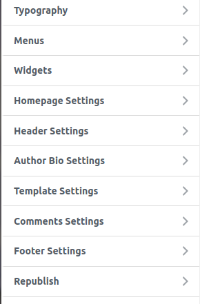
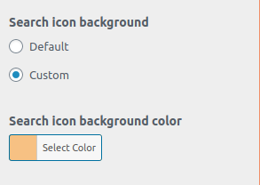

To access the widgets settings click here

Display Author Bio: Display Author Bio under individual posts.

Display author email: Display Author email with bio on individual posts and author archives.

Truncate Author bio: Set a specific length for author bios displayed on single posts.

Author bio length (in characters): Truncates the author bio on single posts to this approximate character length, but without breaking a word.

Check para "Display author social  media links": Display social media links with the author bio on individual posts and author archives (this option requires the Yoast plugin).
