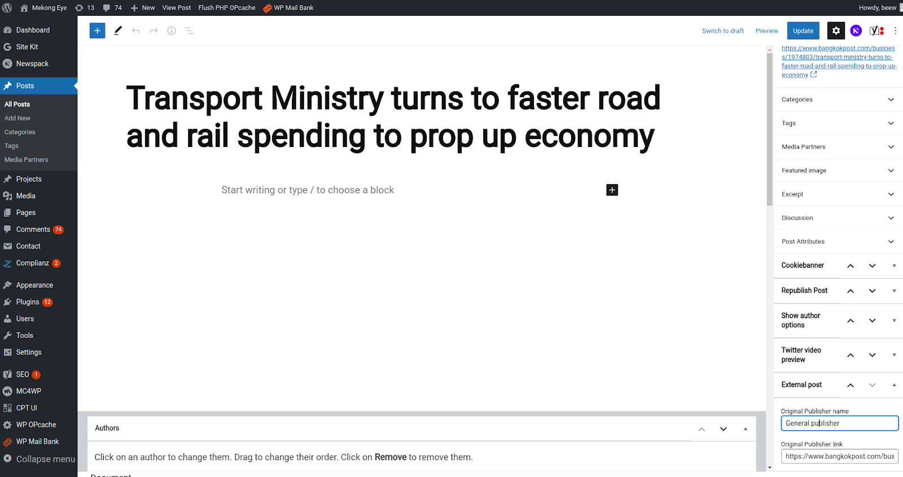
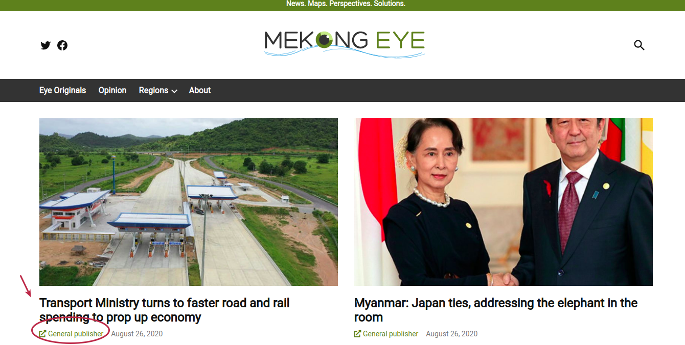

From this functionality you can share a post from another website, inserting in this section the name and link of the website. As soon as the user clicks on the post, they will be taken to the inserted link

## External link configuration

## External link example

