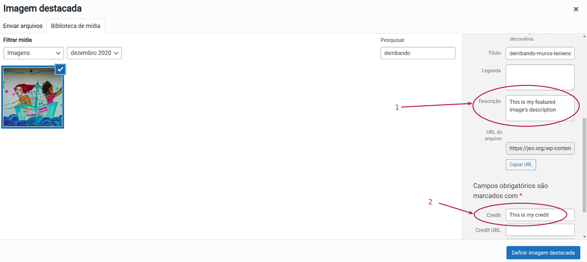
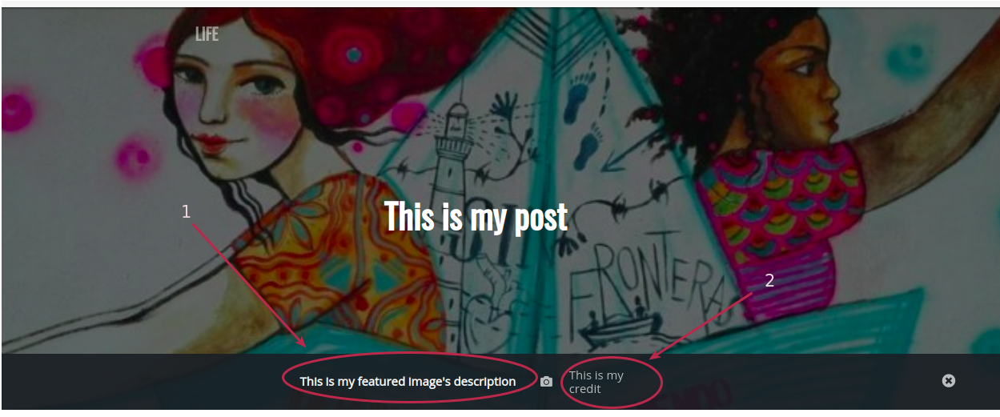

  
The Featured image has three main settings options: behind the title,  large and hidden. Depending on which one you choose the layout changes.

The Featured image  uses 2 fields: Description and Credit

