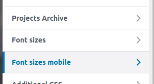

To access the font size settings click here

Select the font size unit: rem, px, em. If you select “px”, the option to increase / decrease the font (A + / A + buttons) will not be available.

Check to enable / disable the use of “! Important”

It is possible to configure the headings (h1, h2, h3, h4, h5, h6) and the paragraph (p)

