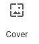

The entire editing experience has been rebuild for media rich pages and posts because since Wordpress 5.0 has included the Gutenberg Editor that give us the ability to build using “Blocks”

Blocks are pieces of content elements. With them, users can insert, rearrange and style multimedia content with very little technical knowledge. 

### [Documentação](https://wordpress.org/gutenberg/)

## Differences between Block Editor Gutenberg and Classic Editor 

Uses a totally different approach, called ‘Blocks’. You can add blocks for each paragraph, images, videos, galleries, audio, lists, and more. 

With the new editor, you can simply add a table block, select your columns and rows, and start adding content. You can move content elements up and down, edit them as individual blocks, and easily create media-rich content. Is easy to use and learn.

A text editor with formatting buttons very similar to Microsoft Word.

## Here is a selection of the default blocks included with Gutenberg

### Heading  
 Works to break your page into sections. Each heading should indicate the start of a new topic.

Settings available: Heading Level (H1, H2, H3, H4, H5 or H6 ), text alignment (left, center, right), bold, italic, strikethrough, inks, HTML Anchor and additional CSS Class

### Vídeo 
 Allows you to embed video files and play them back using a simple player

### Paragraph  
 Works to insert paragraphs of text.
Has an editor to change color, italics, size, links,
Shows basic formatting buttons like: text alignment, bold, italic, insert-link, and strikethrough buttons.

### Columns 
 A way to add columns to your page or post.
With the Columns block, you can quickly and easily adjust your page’s layout.

### Youtube  
 Works to embed a video from a youtube link

### Audio 
![Heading (img/audio.png)] The audio block is for uploading your own audio files (most commonly, .mp3 files) to your site.

### Cover
 The Cover block is a fully-customizable element that can serve a number of purposes. It could be used as a classic hero banner, with a full-width photo background and text overlay.

## Creating a new blog post or page

##  Block edit side menu
When selecting a block, you will find options for configuring that block in this menu.

## Side document editing menu
When you need to change the general configuration of the product and not a specific block, access this menu. Ex: Categories, tags, featured image.

##  When you're done, you can save your post / page as a draft, preview or publish

