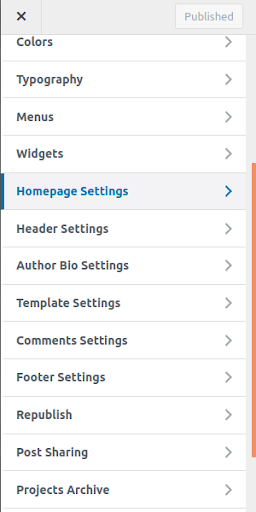
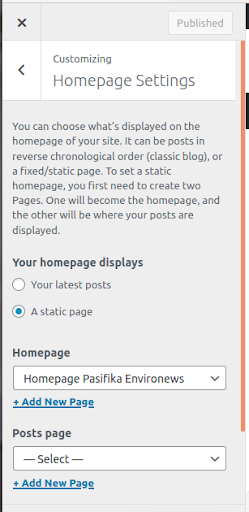
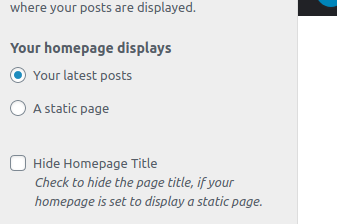

To access the homepage settings click here

Here you define whether your website's 
homepage will be a static page or a page of your latest posts 

If you choose a page from your latest posts, the edition will stop there. You just need to say if you want to hide your page title.

If you choose a static page, you need to insert which page

You can also select a page to be your posts page

