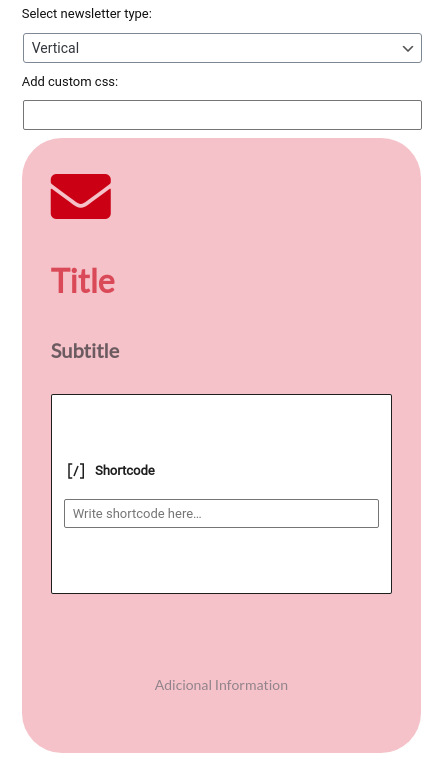
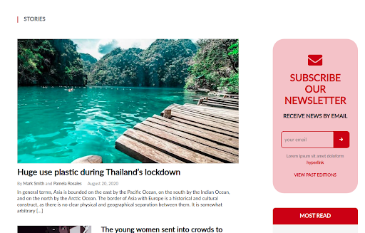
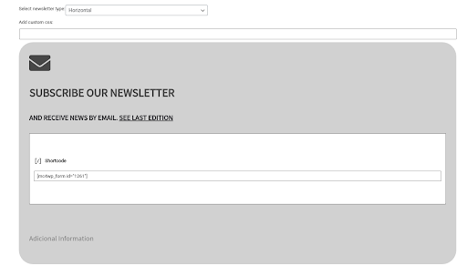

There are 2 versions: horizontal and vertical
The vertical version works better if it is used in a column

Editing the page

Example of how the block looks on the page / post

Editing the page

Example of how the block looks on the page / post

