To access the customization of the website's identity click here

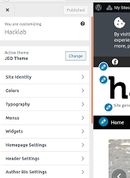

On this page you can manage the elements that make your website’s identity

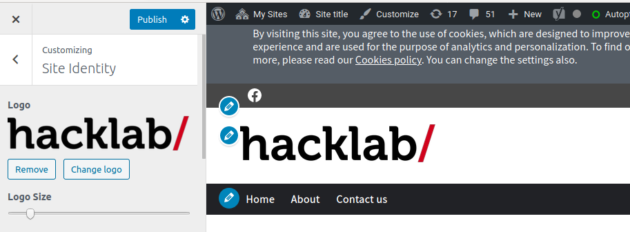

On this page you can manage the elements that make your website’s identity

## Website logo

Here you can upload an image to be the logo of your website, as well as remove it, or change it.

You can also, through the logo size field, define the size that the logo will have on the home

## Footer logo

Here you can upload an image to be the footer logo, as well as remove it, or change it.

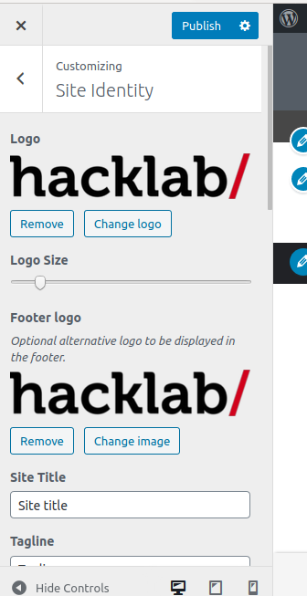

## Site title and tagline

Here you define what will be the title and tagline texts and whether or not they will be displayed

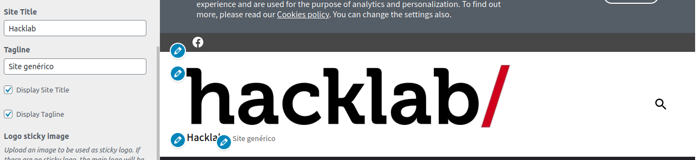

Look:

Example of how looks on the page / post

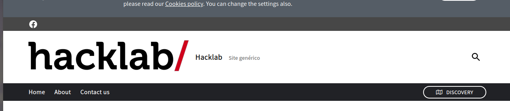

The sticky header is when you go down the page and the header becomes a smaller banner with the logo centered

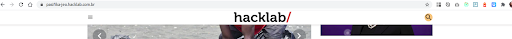

In this case you can add a special logo to be shown at that moment

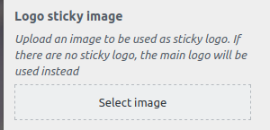

## Decoration special titles

In this field you can define the style of decoration that will accompany some main titles

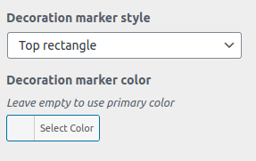

Square
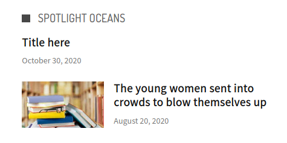

Top rectangle
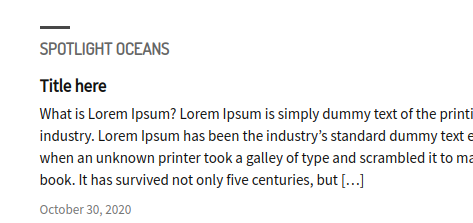

Left bar
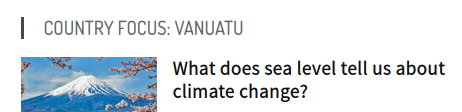

Custom
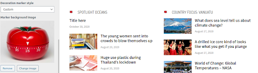

In Custom style you can upload an image to decorate the titles

## Pagination

In this field you can customize the format of the pagination.

The pagination is in the search or also in the posts page of the categories

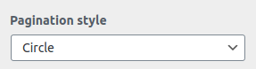

Square
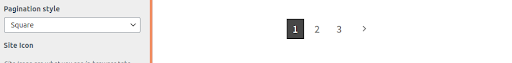

Circle
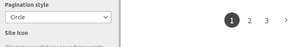

In this field you can enter your website's favicon, which will be displayed in the navigation bar

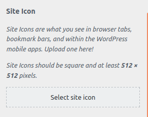
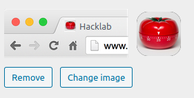
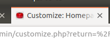

## Publish

Never forget to publish your changes, if you leave customize without publishing your changes, they will be lost.

