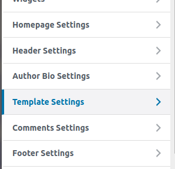
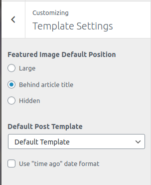

To access the template settings click here

Here you can define the featured image default position

(Options: Large, Behind article title, and Hidden)

And you can define the default post template

(Options: Default template, One column, One column wide)
