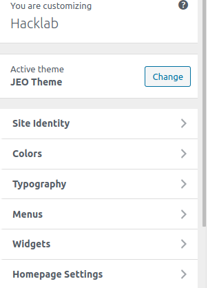
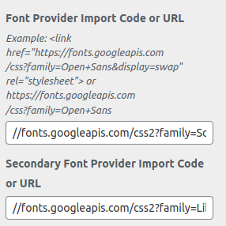
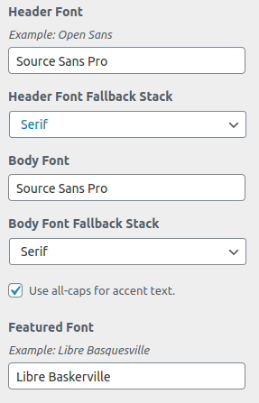
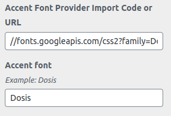

To access the customization of the website's typography click here

Example: <link href="https://fonts.googleapis.com/css?family=Open+Sans&display=swap" rel="stylesheet"> or https://fonts.googleapis.com/css?family=Open+Sans

## Example of Configuration of typography 

Header Font (Example: Open Sans)
Header Font Fallback Stack

Body Font (Example: Open Sans)
Body Font Fallback Stack

Featured Font (Example: Libre Baskerville)
Special heading font (Example: Opens Sans Condensed)
Accent font (Example: Dosis)

