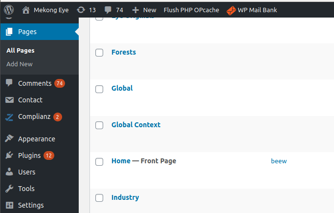
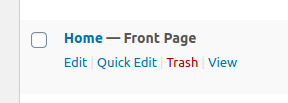
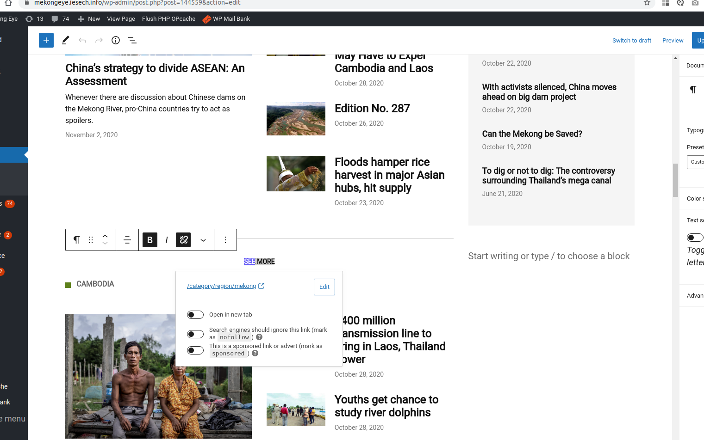

To access the home edition you must click on "Pages" and then on '' All pages "
Then you need to find a homepage

When locating the homepage you can click on the page title or when hovering over the name, click on edit

In the home edition you can choose:

- Show or not the highlighted image
- Show or not the summary
- Show or not the date
- Show or not the category
- Show or not the author

Here, in the button "See more" you can change the text, the link, define whether the link will be opened in the same or in other screens

